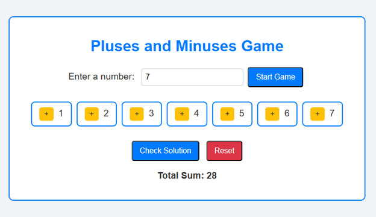

# Plus-and-Minus-Game
Interactive puzzle game based on Algorithmic Puzzles, page #63. Assign +/− to reach sum zero. Built with HTML, JS.

---

## Game Features

- Input any positive integer `n`
- Displays numbers with dynamically assigned `+` and `−` signs
- Solves the puzzle using two different algorithmic strategies
- Runs entirely in the browser

---

## Algorithms Implemented

### Greedy Approach

The greedy algorithm first checks whether the total sum of numbers from `1` to `n` is even.  
If it is odd, a zero-sum partition is impossible.

When the sum is even, the algorithm:
- Targets half of the total sum
- Iterates from `n` down to `1`
- Assigns a `+` sign to the largest possible number that does not exceed the target
- Assigns `−` signs to the remaining numbers

This approach makes locally optimal decisions at each step to reach a valid solution efficiently.

Time Complexity: `O(n)`  
Space Complexity: `O(n)`

---

### Brute-force Approach

The brute-force algorithm explores all possible combinations of `+` and `−` signs using recursive backtracking.

For each combination:
- It assigns a sign to every number from `1` to `n`
- Computes the resulting sum
- Reports the combination if the sum equals `0`

Since every number has two possible signs, the total number of combinations is `2ⁿ`.

Time Complexity: `O(n · 2ⁿ)`  
Space Complexity: `O(n)`

---

## Screenshots

